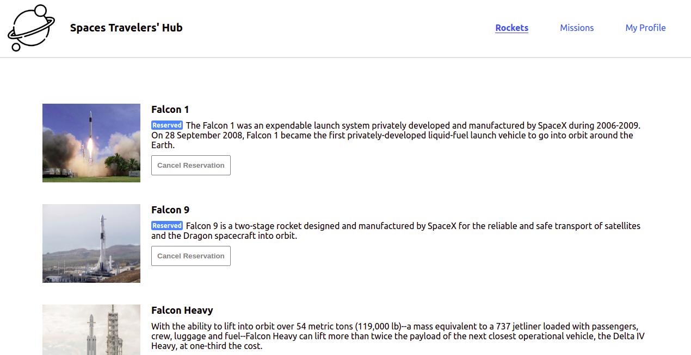
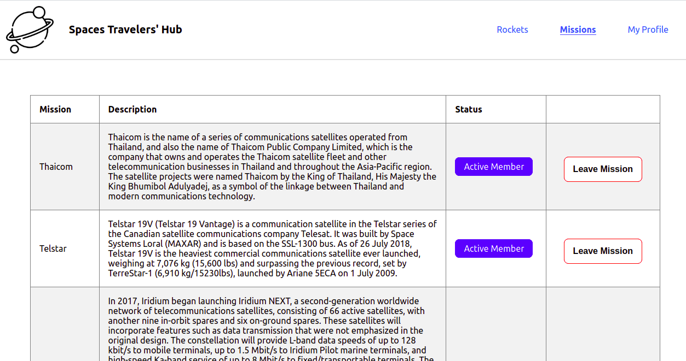
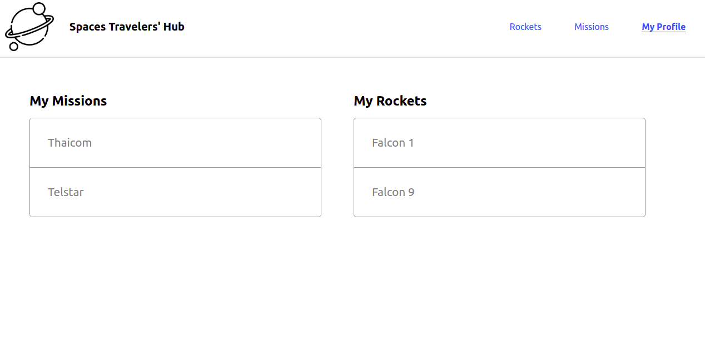

# Live Demo

[Website](https://react-redux-capstone-jose-enmanuel.netlify.app/rockets)

# Space Travelers' Hub - Jose Abel Ramirez Frontany and Enmanuel Lassis





## Built With

- React
- React-dom
- Redux
- Redux-Thunk
- React-Router
- Fetch
- Webpack
- Babel
- HTML
- CSS

## Getting Started

To get a local copy up and running follow these simple example steps.

### Setup

Go to the top of the page, press te green button that says "Code", and copy the link. Then you have to go to your console and type

```
    git clone 'repository-link'
```

That's all, you are ready to go!

### Install

Run the following command to have all yarn packages dependencies installed:

```
    npm install
```

### Usage

To run the "react-scripts start" script, type the following command:

```
    npm start
```

### Tests with React Testing Library

To run the tests files for React Testing Library type the following

```
    npm test
```

### Linters

To run the Javascript linters type the following

```
    npx eslint .
```

To run the CSS linters type the following

```
    npx stylelint "**/*.{css,scss}"
```

## Authors

### Author: Jose Abel Ramirez Frontany\*\*

- GitHub: [Jose Abel Ramirez Frontany](https://github.com/jose-Abel)
- Linkedin: [Jose Abel Ramirez Frontany](www.linkedin.com/in/joseabelramirezfrontany)

### Author: Enmanuel Lassis \*\*

- GitHub: [Enmanuel Lassis](https://github.com/elassis)
- Linkedin: [Enmanuel Lassis](https://www.linkedin.com/in/enmanuel-lassis-pe%C3%B1a/)

## 🤝 Contributing

Contributions, issues, and feature requests are welcome!

## 📝 License

This project is MIT licensed.

## Show your support

Give a ⭐️ if you like this project!
